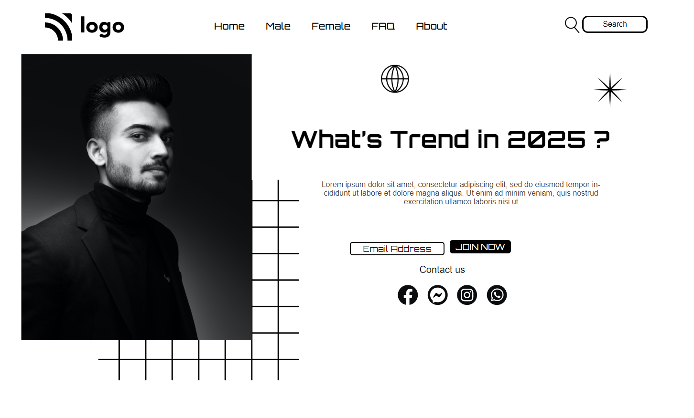

# PROJECT NO. 1

This is my first project of Web Development. I have learnt HTML and positioning concept of CSS. 

## Technologies Used
- HTML
- CSS

## What I leaned

1. Positioning in CSS

# Connect with me

   &ensp;
  &ensp;
  &ensp;
  

